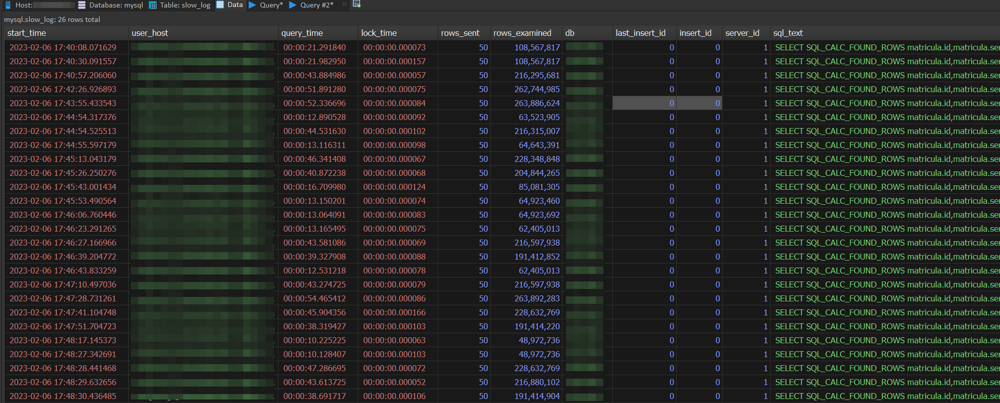

# Books

2024-05-01

Books I've learned from and recommend. Most were listened to in audiobook form while doing dishes or working out at the gym. I might write notes about each here, eventually.

## Books I've read

- The Subtle Art of Not Giving a Fuck (Mark Manson)
- How to Make Friends and Influence People (Dale Carnegie)
- 48 Laws of Power (Robert Greene)
- Why Men Want Sex & Women Need Love (Allan Pease & Barbara Pease)
- The 4-Hour Workweek (Timothy Ferriss)
- Influence: The Psychology of Persuasion (Robert B. Cialdini)
- Outwitting the Devil (Napoleon Hill)
- Think and Grow Rich (Napoleon Hill)
- Rich Dad Poor Dad (Robert T. Kiyosaki and Sharon Lechter)
- The Like Switch: An Ex-FBI Agent's Guide to Influencing, Attracting, and Winning People Over (The Like Switch Series Book 1) (Jack Schafer & Marvin Karlins)
- The Meditations of the Emperor Marcus Aurelius Antoninus (Marcus Aurelius)
- Letters from a Stoic: Epistulae Morales Ad Lucilium (Lucius Annaeus Seneca)
- Market Wizards: Interviews with Top Traders (Jack D. Schwager)
- The New Market Wizards: Conversations with America's Top Traders (Jack D. Schwager)
- Unknown Market Wizards: The Best Traders You've Never Heard Of (Jack D. Schwager)
- Hedge Fund Market Wizards (Jack D. Schwager)
- [Getting Real (Basecamp)](https://basecamp.com/books/getting-real)
- The Art of War (Sun Tzu)

## Want to read next

- [The Programmer's Brain: What every programmer needs to know about cognition
  (Felienne Hermans)](https://www.amazon.com/Programmers-Brain-every-programmer-cognition/dp/1617298670)
- The Pragmatic Programmer: Your Journey to Mastery (Andrew Hunt and David Thomas)
- [Building Secure & Reliable Systems (Heather Adkins, Betsy Beyer, Paul Blankinship, Ana Oprea, Piotr Lewandowski, Adam Stubblefield)](https://google.github.io/building-secure-and-reliable-systems/raw/toc.html)
- [The Site Reliability Workbook (Betsy Beyer, Niall Richard Murphy, David K. Rensin, Kent Kawahara and Stephen Thorne)](https://sre.google/workbook/table-of-contents/)
- [Site Reliability Engineering (Betsy Beyer, Chris Jones, Jennifer Petoff and Niall Richard Murphy)](https://sre.google/sre-book/table-of-contents/)
- [Software Engineering at Google (Hyrum Wright, Titus Winters, and Tom Manshreck)](https://abseil.io/resources/swe-book/html/toc.html)
- The Art of Thinking Clearly (Rolf Dobelli)
- Atomic Habits: An Easy & Proven Way to Build Good Habits & Break Bad Ones (James Clear)
- Everything Is Fucked: A Book About Hope (Mark Manson)
- Convince Them in 90 Seconds or Less: Make Instant Connections That Pay Off in Business and in Life (Nicholas Boothman)
- High Output Management (Andrew S. Grove)
- Who: The A Method for Hiring (Geoff Smart and Randy Street)
- SPIN Selling (Neil Rackham)
- How to Change Your Mind (Michael Pollan)
- The Truth Detector: An Ex-FBI Agent's Guide for Getting People to Reveal the Truth (The Like Switch Series Book 2) (Jack Schafer)
- Thinking, Fast and Slow (Daniel Kahneman)
- Agora's Big Black Book, a compendium of "trade secrets" about writing, marketing, and managing (Mark Morgan Ford & Rocky Vega)
- The Intelligent Investor (Benjamin Graham)
- Coders At Work - Reflections on the Craft of Programming (Peter Seibel)

# Debugging slow MySQL and MariaDB SQL queries

2023-02-07

Execute this on the database server to start logging all queries that take longer than 5 seconds to run:

```sql
SET GLOBAL log_output='TABLE';
SET GLOBAL slow_query_log=1;
SET GLOBAL long_query_time=5.0;
```

Wait a bit and take a look at `slow_log` table in `mysql` database. Any slow queries will end up there:


To turn off query log in case you will execute some heavy queries manually, execute this:

```sql
SET GLOBAL slow_query_log=0;
```

To disable slow query log for a single connection, execute this:

```sql
SET SESSION slow_query_log=0;
```

More info about Slow Query Log on https://mariadb.com/kb/en/slow-query-log-overview
